# nlp_fun
Working with the "Trending Youtube Statistics" dataset, found on: https://www.kaggle.com/datasnaek/youtube/data

The dataset includes data from the US and the UK.

Point of this is to dabble into analyzing data.

## Run
Uses python3. Have to install these packages: wordcloud, nltk

1. run extract.py script (reads original data from files, combines them, preprocesses the comments a bit, outputs them into a .json)

`python3 main/extract.py -s US -o output/preprocUS.json`
- this will read in the US files, and generate an output file at `output/preprocUS.json`

`python3 main/extract.py -s GB -o output/preprocGB.json`
- this will read in the GB files, and generate an output file at `output/preprocGB.json`

Tests:

`python3 main/extract_helpers_test.py`

2. List videos metadata.
Lists all video metadata (likes, views, category, etc) for all videos.

`python3 main/video_list.py -i output/preprocUS.json`

2a. Generate wordclouds by category id.

`python3 main/wordcloud_by_category.py -i output/preprocUS.json -o output/wordcloudsUS -s US -c 24`
- this will generate a wordcloud for all of the comments of all of the videos that are in category id 24 (Entertainment), for US videos.
- to see the list of category ids, look at the `*_category_id.json` files (in the `data` directory).
- some categories don't have videos

`python3 main/wordcloud_by_category.py -i output/preprocUS.json -o output/wordcloudsUS -s US`
- this will go through every category and generate a wordcloud for all comments for that category

2b. Generate wordclouds by video id.
A variant of 2a, where we generate a wordcloud for a specific video id.

Example:

`python3 main/wordcloud_by_id.py -i output/preprocUS.json -o output/wordcloudsUS -v ckXN4Tc6-c8`

This will generate a wordcloud file, `ckXN4Tc6-c8.png` in `output/wordcloudUS`.

3. Sentiments and wordclouds, by category id.

A variant of 2a, where I go through all the videos of a specific category id.
Then, I use nltk/vader to get the sentiment score of each comment, each video in that category.
I separate comments based on if they have positive or negative sentiment.
Then, I generate a wordcloud for all the positive comments, and a wordcloud for all the negative comments.

`python3 main/sentiments.py -i output/preprocUS.json -o output/wordcloudsUS -s US -c 25`

4. Analysis

`python3 main/analysis.py -i output/preprocUS.json -o output/analysisUS -c 24`

This will run an analysis on the top comments of the top videos for videos with category id = 24.
The input is specified by the -i option, and can be either the preprocUS.json or the preprocGB.json.
There will be text output, containing the top video data and comment data.

The script will also generate 2 wordclouds - one for the positive comments and one for the negative comments,
where once again we look at the top comments of the top videos for videos with specified category id. 


## Results
Listing some perhaps interesting findings from the data.

I'm not going to analyze all the categories. Some of them are more interesting to me than others,
such as Music, Entertainment, News & Politics, etc.

Again, the analysis is done on the top comments of the top videos for the category.
I take the top 30 comments for each of the top 20 videos.
 
NOTE: Since Youtube's comment API is not that great, the top comments are not necessarily the top comments.

A comment's sentiment is determined by NLTK's vader algorithm. It is not guaranteed to be accurate.
I classify a positive comment as a comment with a compound score > 0.3, and a negative comment as a comment with
a compound score < 0.3. (Compound scores are normalized from -1 to 1, where -1 is very negative, and 1 is very positive)
The compound score is a normalization of the "pos", "neg", and "neu" scores. If you want to learn more about it, just
search for NLTK/Vader.

### Entertainment (catid=24)
#### US Wordclouds

Words from Positive Comments:

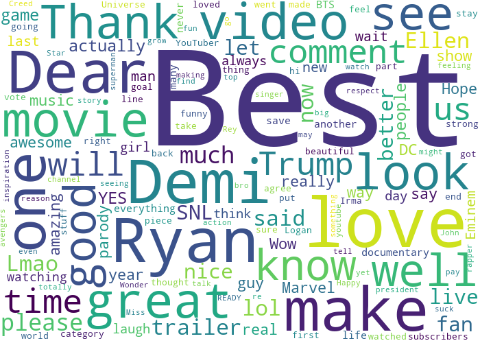

Words from Negative Comments:

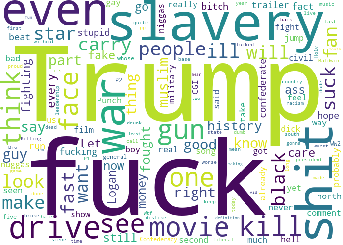

#### GB Wordclouds
Words from Positive Comments:

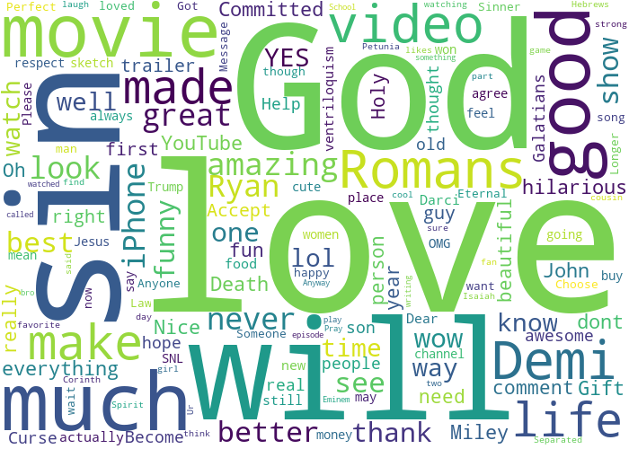

Words from Negative Comments:

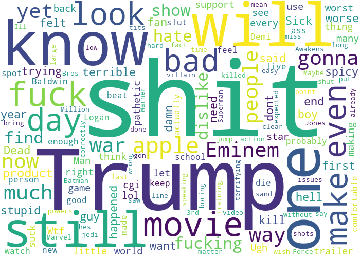


#### Wordcloud Commentary
Perhaps unsurprisingly, "Trump" comes up as a key word in negative comments, in both the US and GB datasets.
"Trump" also comes up as a key word in positive comments as well, but not as frequently.

Brits seem to prefer the word "shit" in their negative comments, while Americans seem to prefer "fuck".
Interestingly, "slavery" comes up as a word used in negative comments for the US dataset, and it doesn't come up for
the GB dataset.
As for the positive words, "love" is a common term among the Brits, and Americans seem to have a 
higher affinity for Demi Lovato.

#### US Comment Data
There were certainly many positive comments coming from Demi Lovato's `Simply Complicated` documentary.
The video had: 5414714 views, 315287 likes, 3382 dislikes, and 500 replies.
Let's see what those comments looked like:

```
I’m not a big fan of Demi but I do like her music. After seeing this documentary, I’m speechless. Demi you’re such an inspiration and I see you a whole different way. It’s so brave of you to talk about your personal life and make it into a documentary for us to see the real you. This was amazing and I’m so glad I had the chance the real you and your struggle. Love you Demi♥️ and stay strong♥️ Your music helped me out a lot when I was younger. Thank you for this 💕
compound: 0.99, pos: 0.31, neg: 0.04, neu: 0.65
```

```
First of all.. this was perfectly imperfect the way she was so raw and open about everything. But am I the only one that noticed the laugh at 9:53? Like she’s always had her signature laugh. Love everything about this. So much inspiration and love 💛
compound: 0.98, pos: 0.40, neg: 0.04, neu: 0.56
```

```
Loved it! Artists like Demi are the reason that I love to sing. Watching this just inspires me to be the best I can be and follow my dreams of becoming a singer!
compound: 0.97, pos: 0.47, neg: 0.00, neu: 0.53
```

Looking further into the file at `output/24-output.txt`, 24/30 of the comments of this video were classified
as positive, most of them having a compound score of 0.8 or higher. This is very positive, and suggests that
Demi Lovato has some sort of positive effect on Americans.

As mentioned before, the NLTK/Vader library is sometimes inaccurate. The comment with lowest sentiment score was the
following:

```
i wish demi had her own show where we can just see more like this but then i also would know it’d be too much pressure for her at times :(
compound: -0.60, pos: 0.11, neg: 0.19, neu: 0.71
```

As we can see, this is a comment that expresses both positive and negative sentiments, but is overall classified as negative.
I personally disagree with this rating, but of course it is subjective.

How about some of the other videos? 
The video, `First Look! Ellen Scores Deleted Scenes from Taylor Swift's 'Look What You Made Me Do'` from `TheEllenShow`
had a lot of positive comment scores, as well as the `Stranger Things 2 | Final Trailer [HD] | Netflix]` video by `Netflix`.

The videos where the top comments had a lot of negative sentiment, were:
`Eminem Rips Donald Trump In BET Hip Hop Awards Freestyle Cypher]` by `BETNetworks`,
`The Chaos President Cold Open - SNL]` by `Saturday Night Live`, and 
`Confederacy: Last Week Tonight with John Oliver (HBO)]` by `LastWeekTonight`.

If you look at the comments for these videos, they tend to show the typical polarization that we come to expect from
Generally, the video talks about Trump in some form, and a portion of the comments that get rated as positive are comments
that praise the video for attacking Trump. The other fraction of the comments that get rated as negative are comments 
that disagree with the video content.

For example, in the `LastWeekTonight` video, here is a positive and negative comment:
```
John you are great lol
compound: 0.78, pos: 0.70, neg: 0.00, neu: 0.30
```

```
Youtube, if I wanted to see some boob on TV I'd have kept cable. Seeing as how we now have the internet please stop *FEATURING* corporate controlled puppets in your fake Trending list.
compound: -0.46, pos: 0.06, neg: 0.14, neu: 0.79
```

#### GB Comment Data
For the most part, the GB comments are similar to the US comments. There is a bit of overlap in the top videos 
between US / UK as well.

The `Stranger Things 2 | Final Trailer [HD] | Netflix]` by `Netflix` has a lot of positive sentiment. 
A simple comment that was scored highly was:
```
YES YES YES YES YES YES
compound: 0.93, pos: 1.00, neg: 0.00, neu: 0.00
```

Still, there were a few videos that had more controversy. For example, the `TOMB RAIDER - Official Trailer #1]` by
`Warner Bros. Pictures`. Here is one of the more negative comments:

```
she doesn't have the TITS or ASS to be lara croft. massive fucking fail warner faggots.
compound: -0.91, pos: 0.08, neg: 0.47, neu: 0.45
```

### Music (catid=10)
#### US Wordclouds

Words from Positive Comments:

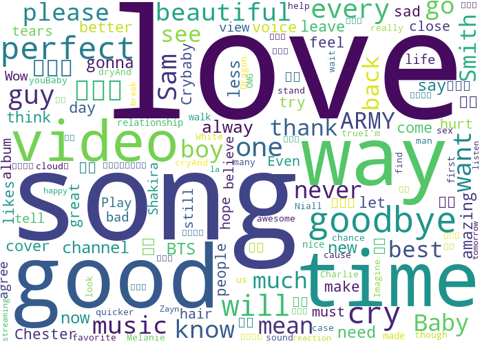

Words from Negative Comments:

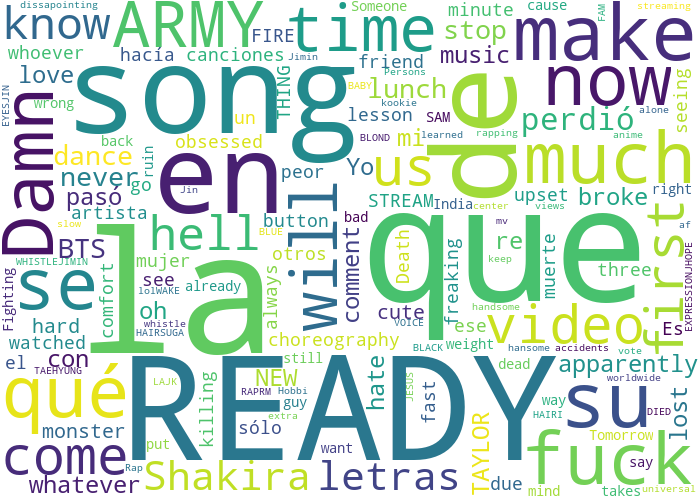

#### GB Wordclouds
Words from Positive Comments:

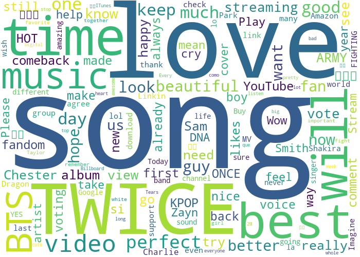

Words from Negative Comments:

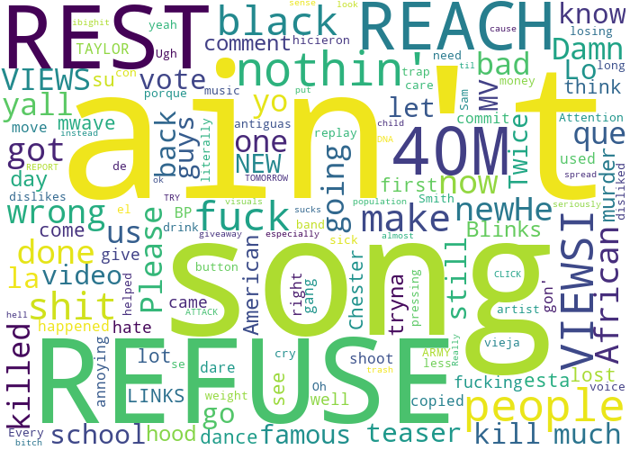

#### Comments
For the US positive words wordcloud, the [] symbols are a result of Korean Kpop videos. These don't show up in the 
GB data, indicating a lower weeb population in Britain.

There really isn't much to say about the specific comments. The noteworthy thing here is that the majority of
comments in music videos have high positive sentiments. Sure, there are a few negative comments, but most of the time
when people go to youtube for music, it's because they actually want to listen to the song. As a result, they are
more likely to leave a positive comment. At least, that's what I think.

### Howto & Style (catid=26)
#### US Wordclouds

Words from Positive Comments:

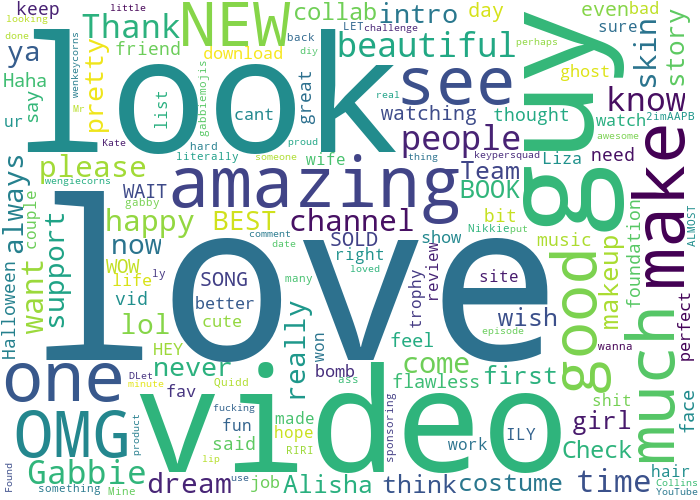

Words from Negative Comments:

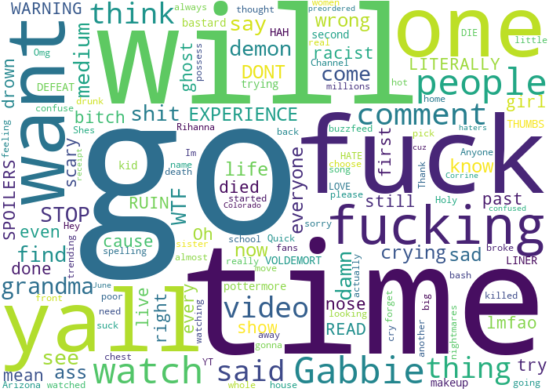

#### GB Wordclouds
Words from Positive Comments:

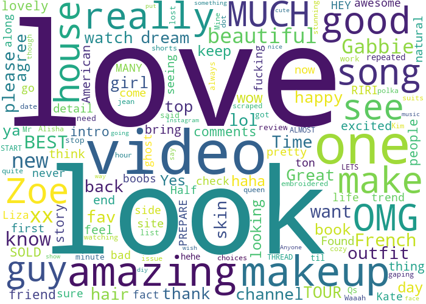

Words from Negative Comments:

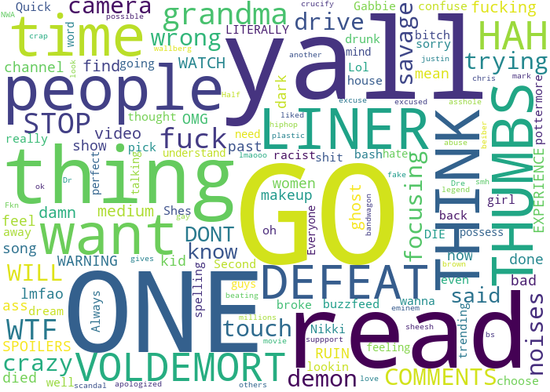

#### Comments
I don't know much of anything about the plethora of HowTo makeup / hairstyle personalities out there. From these
wordclouds, but apparently "love" is a common term used in positive comments, such as:

```
I love this omg
compound: 0.64, pos: 0.68, neg: 0.00, neu: 0.32
```

and apparently there is a popular person named Gabbie from The Gabbie Show. 

Unsurprisngly a lot of comments and content creators in this category are by females, and the comments
have a distinctive female style. For example, in the video `20 DIY Halloween Costumes 2017!! Alisha Marie`
by `AlishaMarie`, a comment like this could only have been written by a female:

```
wow this video was amazing!!! u and ashley are the cutest! loves the masters inc one w you sis
compound: 0.95, pos: 0.56, neg: 0.00, neu: 0.44
```


### Other?
I've pretty much done what I wanted to do with this dataset. Obviously there are more things I could
explore, but it's getting a bit tedious at this point to work with the same static dataset. I'll move on
to something else now.
